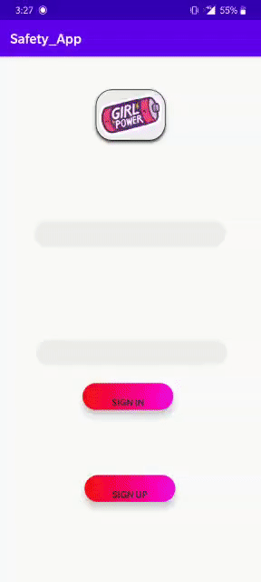

 <h1> Save Daughter 👸 

#### An Instant Alert Generating System for Protection of Women, made on Women's Day Itself.

### The Problem This App Solves
Many times women feel insecure and are in urgent need of help. This app considers various scenarios along with efficient algorithm to locate nearest police stations and inform them.

### Challenges We Ran Into
The main challenge of this project is locating nearest police stations and segregate map to distinct regions without using any external paid API.

### Demo:

_This App Was Made Within 20hrs in Hackathon at CodeShastra - D J Sanghvi._  
_This App made it to Top 10 among 80 Teams_
